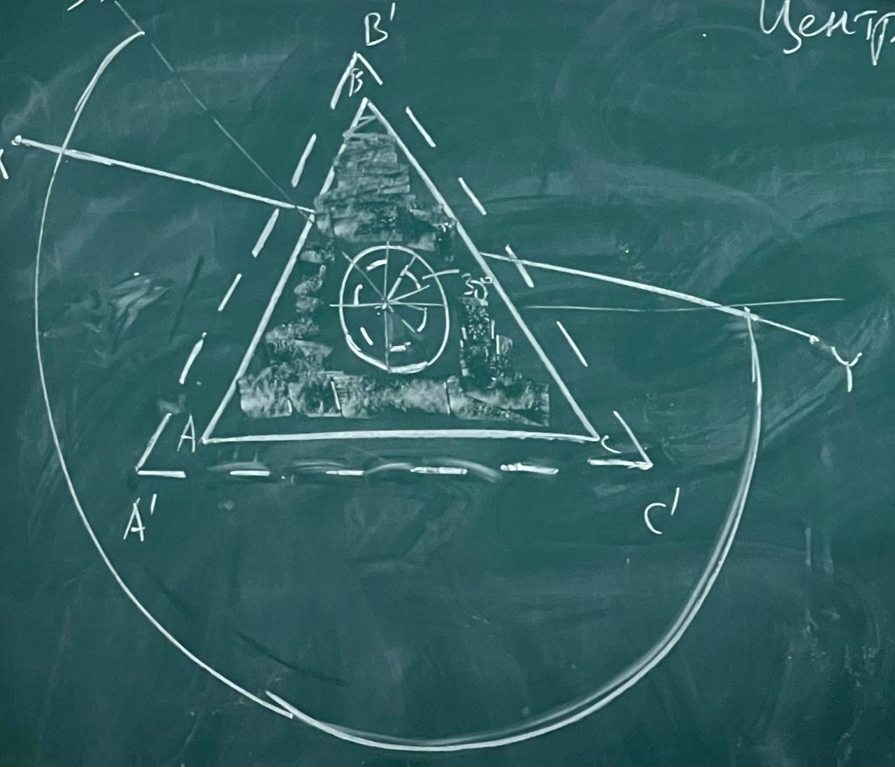
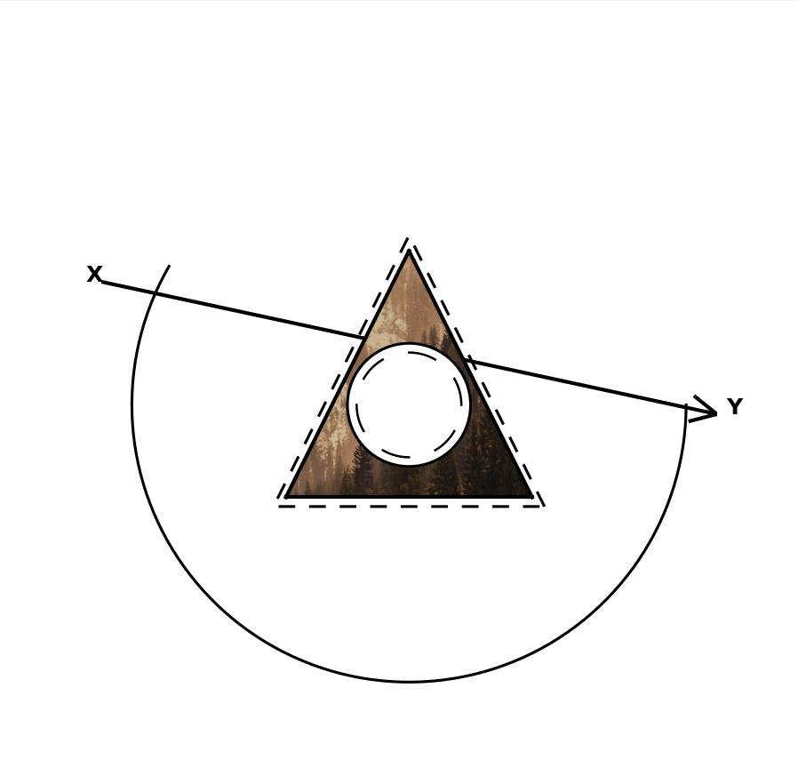

# Рубежный контроль 1 по 3d моделированию
#Симанков Иван ИУ8-52

## Условие:

### Задание: 
*На основе изображения, требуется воспроизвести заданную фигуру. Для построения ее контуров необходимо использовать классический алгоритм Брезенхема. Критерием успешного выполнения является идентичность полученного изображения предоставленному образцу.*
___
## Выполнение:

### Листинг кода Python 

[Код](rk1_3d.py)

```
import matplotlib.pyplot as plt
import numpy as np
from matplotlib.patches import Polygon
from matplotlib.image import imread


def bresenham_line_ultra_quality(x0, y0, x1, y1):
    """ультра-качественный алгоритм брезенхема с максимальной плотностью точек (чтобы избежать зигзагообразных линий)"""
    # используем очень большое количество точек для идеально прямой линии
    distance = np.hypot(x1 - x0, y1 - y0)
    num_points = max(500, int(distance * 3))  # минимум 500 точек, пропорционально длине

    points = []
    t_values = np.linspace(0, 1, num_points)

    for t in t_values:
        x = x0 + t * (x1 - x0)
        y = y0 + t * (y1 - y0)
        points.append((x, y))  # не округляем для максимальной гладкости

    return points


def bresenham_line(x0, y0, x1, y1, ultra_quality=False):
    """алгоритм брезенхема для рисования линии"""
    if ultra_quality:
        return bresenham_line_ultra_quality(x0, y0, x1, y1)

    points = []
    dx = abs(x1 - x0)
    dy = abs(y1 - y0)
    x, y = x0, y0
    sx = -1 if x0 > x1 else 1
    sy = -1 if y0 > y1 else 1

    if dx > dy:
        err = dx / 2.0
        while x != x1:
            points.append((x, y))
            err -= dy
            if err < 0:
                y += sy
                err += dx
            x += sx
    else:
        err = dy / 2.0
        while y != y1:
            points.append((x, y))
            err -= dx
            if err < 0:
                x += sx
                err += dy
            y += sy
    points.append((x, y))
    return points


def draw_line_bresenham(ax, x0, y0, x1, y1, ultra_quality=False, **kwargs):
    """рисует линию используя алгоритм брезенхема"""
    points = bresenham_line(x0, y0, x1, y1, ultra_quality=ultra_quality)
    if points:
        x_vals, y_vals = zip(*points)
        # используем solid linestyle и убираем маркеры
        ax.plot(x_vals, y_vals, linestyle='-', marker='', **kwargs)


def draw_triangle_bresenham(ax, points, ultra_quality=False, **kwargs):
    """рисует треугольник используя алгоритм брезенхема"""
    for i in range(len(points)):
        x0, y0 = points[i]
        x1, y1 = points[(i + 1) % len(points)]
        draw_line_bresenham(ax, x0, y0, x1, y1, ultra_quality=ultra_quality, **kwargs)


def draw_arrow_bresenham(ax, x0, y0, x1, y1, arrow_size=10, ultra_quality=False, **kwargs):
    """рисует стрелку с наконечником используя алгоритм брезенхема"""
    # рисуем основную линию
    draw_line_bresenham(ax, x0, y0, x1, y1, ultra_quality=ultra_quality, **kwargs)

    # вычисляем направление линии
    dx = x1 - x0
    dy = y1 - y0
    length = np.hypot(dx, dy)

    if length > 0:
        # нормализуем вектор направления
        dx /= length
        dy /= length

        # вычисляем перпендикулярный вектор
        perp_dx = -dy
        perp_dy = dx

        # точки для стрелочки
        arrow_tip = (x1, y1)
        arrow_left = (
            x1 - dx * arrow_size + perp_dx * arrow_size * 0.5,
            y1 - dy * arrow_size + perp_dy * arrow_size * 0.5
        )
        arrow_right = (
            x1 - dx * arrow_size - perp_dx * arrow_size * 0.5,
            y1 - dy * arrow_size - perp_dy * arrow_size * 0.5
        )

        # рисуем стороны стрелочки
        draw_line_bresenham(ax, arrow_tip[0], arrow_tip[1], arrow_left[0], arrow_left[1],
                            ultra_quality=ultra_quality, **kwargs)
        draw_line_bresenham(ax, arrow_tip[0], arrow_tip[1], arrow_right[0], arrow_right[1],
                            ultra_quality=ultra_quality, **kwargs)


def line_intersection(p1, p2, p3, p4):
    """находит точку пересечения двух отрезков"""
    x1, y1 = p1
    x2, y2 = p2
    x3, y3 = p3
    x4, y4 = p4

    denom = (x1 - x2) * (y3 - y4) - (y1 - y2) * (x3 - x4)
    if denom == 0:
        return None  # линии параллельны

    t = ((x1 - x3) * (y3 - y4) - (y1 - y3) * (x3 - x4)) / denom
    u = -((x1 - x2) * (y1 - y3) - (y1 - y2) * (x1 - x3)) / denom

    if 0 <= t <= 1 and 0 <= u <= 1:
        x = x1 + t * (x2 - x1)
        y = y1 + t * (y2 - y1)
        return (x, y)
    return None


# исходные координаты
A = (60, 130)
A_ = (56, 133)
B = (100, 50)
B_ = (100, 45)
C = (140, 130)
C_ = (144, 133)
O = (100, 100)

r = 20
r_ = 17
R = 90


def rotate_180(points, center=(100, 100)):
    cx, cy = center
    rotated = []
    for x, y in points:
        x_new = 2 * cx - x
        y_new = 2 * cy - y
        rotated.append((x_new, y_new))
    return rotated


A, B, C, A_, B_, C_ = rotate_180([A, B, C, A_, B_, C_])

fig, ax = plt.subplots(figsize=(6, 6))
ax.set_aspect('equal')
ax.set_xlim(0, 200)
ax.set_ylim(0, 200)
ax.axis('off')

image_path = "/Users/ivans/Downloads/bleb.png"
try:
    img = imread(image_path)
    triangle_mask = Polygon([A, B, C], closed=True, transform=ax.transData)
    ax.imshow(img, extent=[0, 200, 0, 200], clip_path=triangle_mask, clip_on=True)
except FileNotFoundError:
    print(f"ERROR!️ картинка '{image_path}' не найдена, фон треугольника отсутствует.")

# рисуем основные треугольники алгоритмом брезенхема
draw_triangle_bresenham(ax, [A, B, C], ultra_quality=True, color='black', linewidth=2)

# пунктирный треугольник - используем стандартный matplotlib для скорости
dash_pattern = (0, (6, 5))
x_dash, y_dash = zip(*[A_, B_, C_, A_])
ax.plot(x_dash, y_dash, color='black', linestyle=dash_pattern, linewidth=1.5)

# рисуем круги и дуги
circle_small_bg = plt.Circle(O, r_, color='white', zorder=2)
ax.add_artist(circle_small_bg)

# маленькие дуги на внутреннем круге - стандартный matplotlib
for angle in np.arange(0, 360, 60):
    theta = np.radians(np.linspace(angle, angle + 30, 30))
    x_small = O[0] + r_ * np.cos(theta)
    y_small = O[1] + r_ * np.sin(theta)
    ax.plot(x_small, y_small, color='black', linewidth=1.2, zorder=3)

circle_outer_bg = plt.Circle(O, r, color='white', zorder=2)
ax.add_artist(circle_outer_bg)

# внешний круг - стандартный matplotlib
circle_outer = plt.Circle(O, r, color='black', fill=False, linewidth=1.5, zorder=3)
ax.add_artist(circle_outer)

# большая дуга - стандартный matplotlib
theta = np.linspace(-np.pi / 6, np.pi, 100)
x_arc = O[0] + R * np.cos(theta + np.pi)
y_arc = O[1] + R * np.sin(theta + np.pi)
ax.plot(x_arc, y_arc, color='black', linewidth=1.5, zorder=4)

# стрелка - рисуем отдельно части до и после треугольника
start = (0, 140)
end = (200, 97)

# находим точки пересечения стрелки с треугольником
intersections = []
triangle_sides = [(A, B), (B, C), (C, A)]

for side in triangle_sides:
    intersection = line_intersection(start, end, side[0], side[1])
    if intersection:
        intersections.append(intersection)

# если нашли 2 точки пересечения (вход и выход)
if len(intersections) == 2:
    # сортируем точки по расстоянию от начала стрелки
    intersections.sort(key=lambda p: np.hypot(p[0] - start[0], p[1] - start[1]))

    # рисуем первую часть стрелки (до входа в треугольник)
    draw_arrow_bresenham(ax, start[0], start[1], intersections[0][0], intersections[0][1],
                         arrow_size=0, ultra_quality=True,  # arrow_size=0 чтобы не рисовать стрелку здесь
                         color='black', linewidth=2)

    # рисуем вторую часть стрелки (после выхода из треугольника)
    draw_arrow_bresenham(ax, intersections[1][0], intersections[1][1], end[0], end[1],
                         arrow_size=8, ultra_quality=True,
                         color='black', linewidth=2)
else:
    # если не нашли пересечений, рисуем полную стрелку
    draw_arrow_bresenham(ax, start[0], start[1], end[0], end[1],
                         arrow_size=8, ultra_quality=True,
                         color='black', linewidth=2)

ax.text(end[0] + 3, end[1], 'Y', fontsize=12, weight='bold')
ax.text(start[0] - 5, start[1], 'X', fontsize=12, weight='bold')

ax.set_facecolor('white')
fig.patch.set_facecolor('white')

plt.show()
```
___

## Результат


